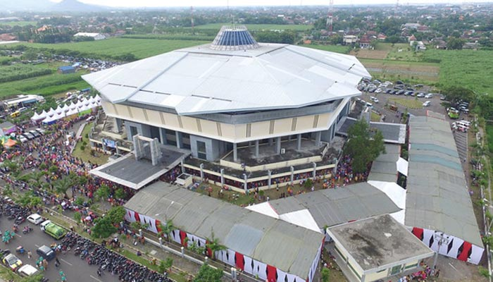
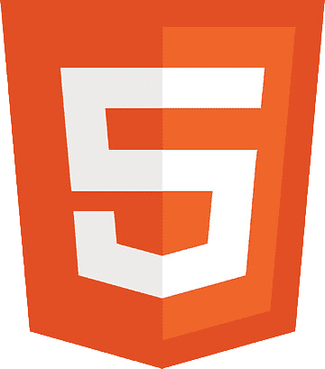
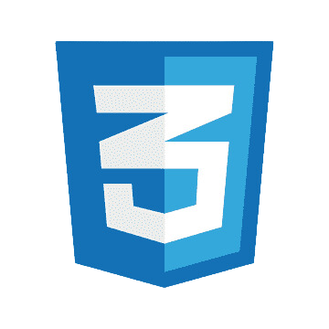
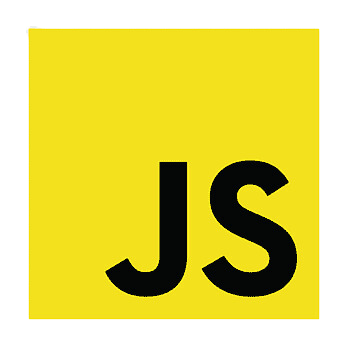
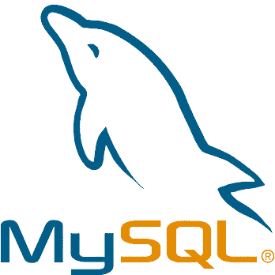

<p align="center">
    
</p>

<h1 align="center">Sistem Reservasi Lapangan GOR Jayabaya</h1>

<p align="center">
    Aplikasi web untuk mempermudah proses pemesanan dan pengelolaan lapangan di GOR Jayabaya Kediri.
</p>

---

## 📌 Deskripsi Proyek

Sistem Reservasi Lapangan GOR Jayabaya adalah aplikasi berbasis web yang dikembangkan menggunakan Laravel. Aplikasi ini dirancang untuk memudahkan pemesanan lapangan olahraga (futsal, basket, voli) secara online. Terdapat dua peran utama: pengguna (pelanggan) dan admin (pengelola GOR). Sistem ini mendukung pengelolaan jadwal, harga sewa per jam, serta laporan keuangan.

📄 Panduan Pengguna: [User Manual](https://drive.google.com/file/d/1oazPPKuRSihJqGgtEH3ukz7mwZsrX9JR/view?usp=drive_link)

---

## 🛠 Teknologi yang Digunakan

<div align="center">
  
  
  
  
  
  
</div>

---

## ⚙️ Fitur Utama

- 🔐 Autentikasi pengguna (login & register)
- 📅 Pemesanan lapangan berdasarkan tanggal dan waktu
- 💰 Harga berbeda untuk siang dan malam
- 📝 Persetujuan & penolakan reservasi oleh admin
- ⚙️ CRUD data lapangan, harga, dan pengguna
- 📊 Laporan pendapatan otomatis

---

## File Penting
database ada difolder database_sql
## 📁 Struktur Folder


- `app/`
  - `Http/Controllers/`
    - `Admin/`
    - `User/`
  - `Models/`
- `public/`
  - `assets/image/`
- `resources/`
  - `views/`
- `routes/`
  - `web.php`
- `database/`
  - `migrations/`

---

## 🚀 Cara Menjalankan Proyek

### 1. Clone Repository
```bash
git clone https://github.com/username/nama-repo.git
cd nama-repo
```
### 2. Install Dependency
```bash
composer install
npm install
npm run dev
```
### 3. Atur Environment
```bash
cp .env.example .env
php artisan key:generate
```

### 4. Migrasi & Seed Database
```bash
php artisan migrate --seed
```
### 5. Jalankan Server
```bash
php artisan serve
```


